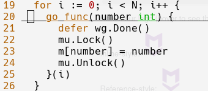

# Q5

### Backend Golang

#### Issues

The go function on line 19 only output a single value (which is 10). It needs to have 10 different value according to the loop

#### Solution

Give a parameter to the go function (func literal) because the go function treated the parameter and the **i** value differently
to avoid unnecessary behavior. Below is the figure of the go function:

Command to run:

> go run main.go
